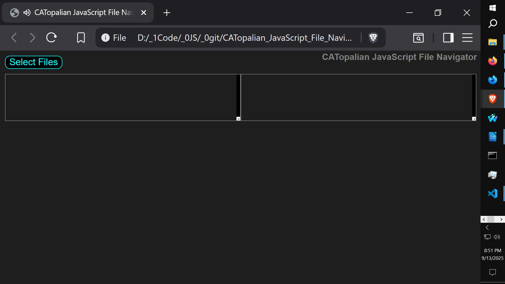
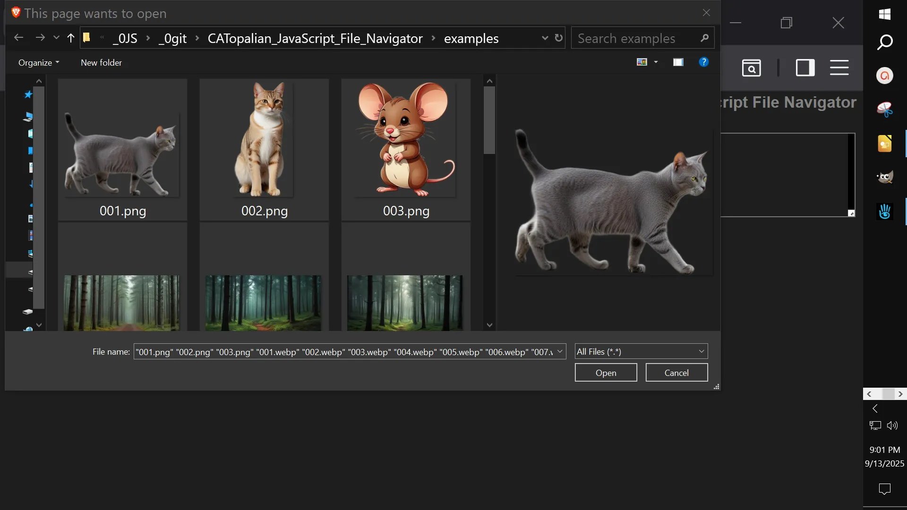
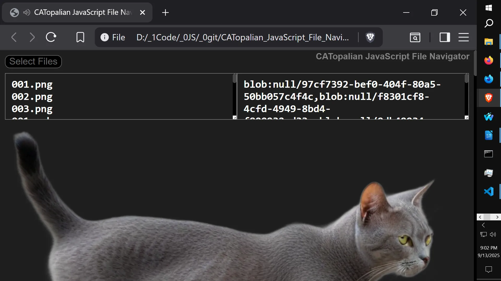
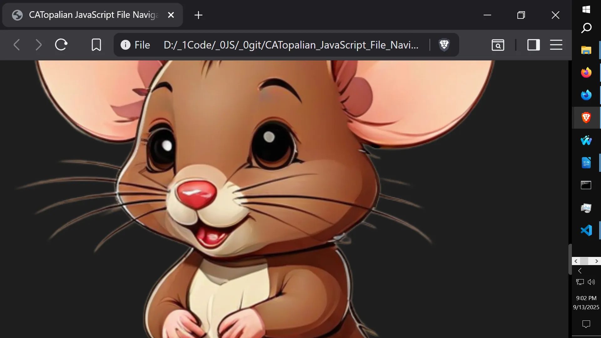
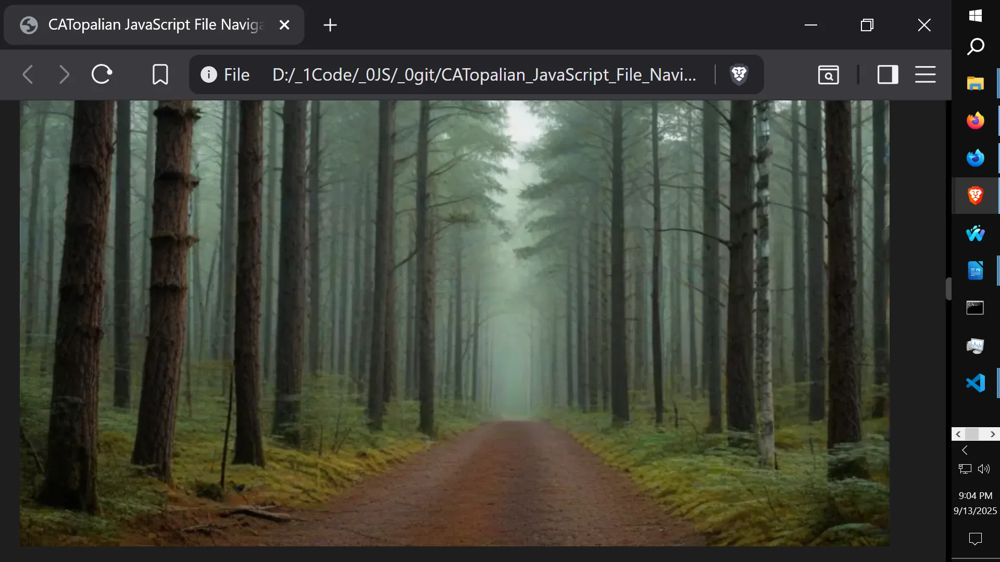
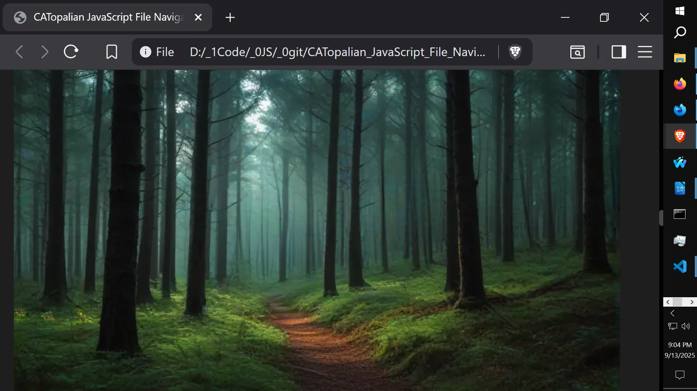
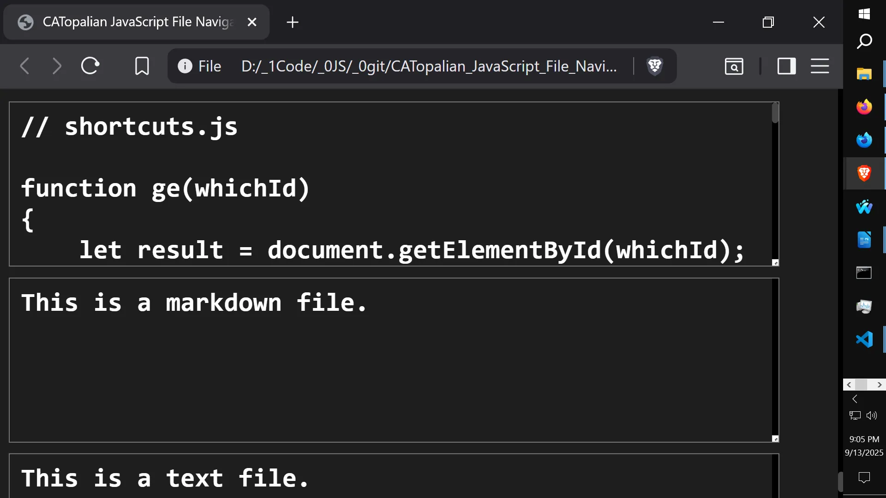

# CATopalian JavaScript File Navigator
A JavaScript app that allows the user to select multiple files using a button input and shows the file names in one textarea and the blobURL's in another textarea.  
It also displays the content of the files on to the screen.

---

Video: https://www.youtube.com/watch?v=wlvtbbXEvXM

---

---

**How to Download this App**
1. Click the green Code Button on this github page
2. Choose Download ZIP
3. Save the Zip File
4. Extract All
5. Double click the html file to start the App

---

//----//

// Dedicated to God the Father  
// All Rights Reserved Christopher Andrew Topalian Copyright 2000-2025  
// https://github.com/ChristopherTopalian  
// https://github.com/ChristopherAndrewTopalian  
// https://sites.google.com/view/CollegeOfScripting  

